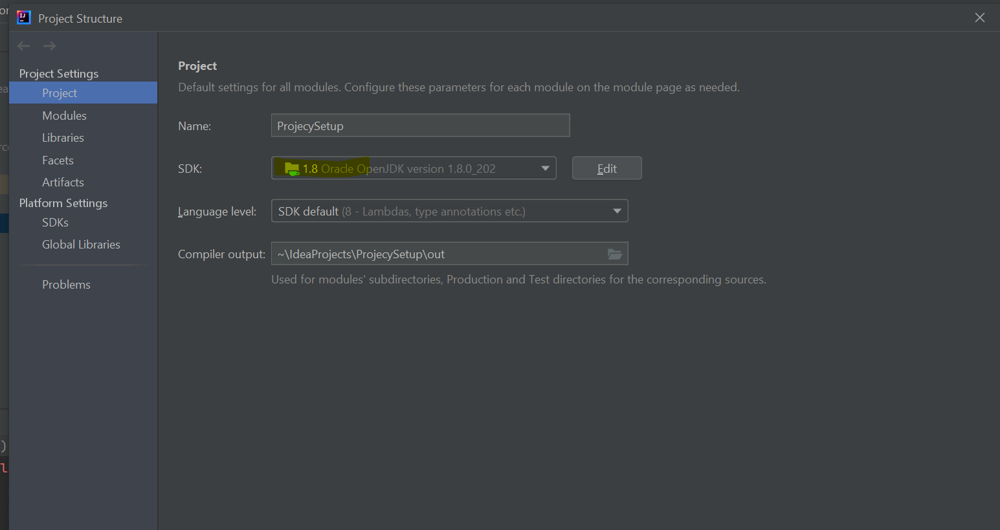
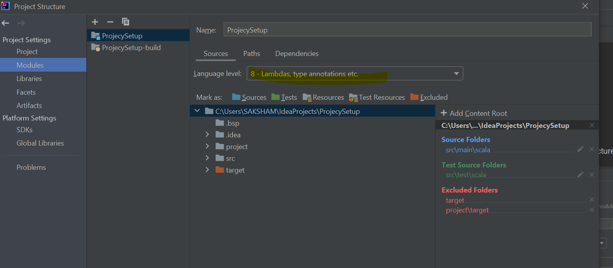
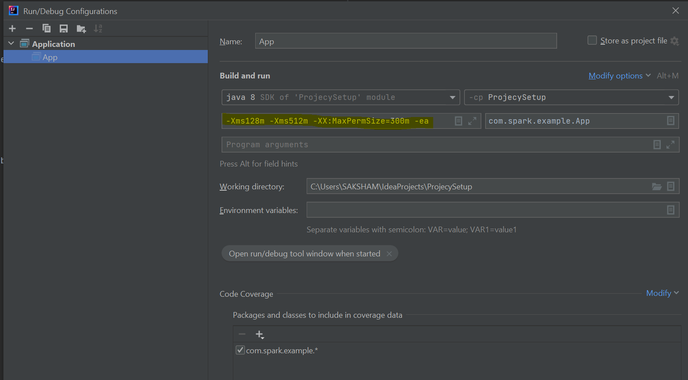
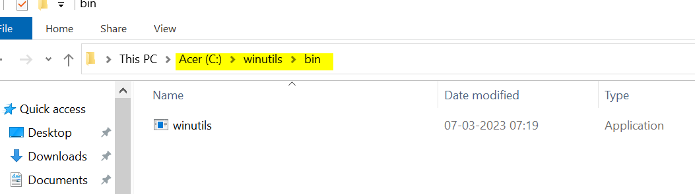

## Spark Scala With SBT
1. Install Intelli J
2. Get Scala Plugin
3. Create New Project -> Scala Project USing SBT
4. Update build.sbt file as is from this repo
5. Assign jdk 1.8(provided in SetupRelatedFiles) in project setting || Navigation file -> project structure -> project setting ->

6. modules (8 level)

7. Make Run Configuration as  below after selecting modifying options and select VM Config and put values as "-Xms128m -Xms512m -XX:MaxPermSize=300m -ea"

8. Not mandatory setting but can be made to avoid some errors
   1. System.setProperty("hadoop.home.dir", "C:\\winutils")(provided in SetupRelatedFiles) use this in code and save 
   2. 

9. Medium Article which helped. https://medium.com/@ariellemesser/building-a-scala-spark-library-with-sbt-and-installing-on-databricks-acd5d8715c4
10. SetupRelatedFiles Folder removed as it was having files more than 200MB which typical GIT doesn't support. 